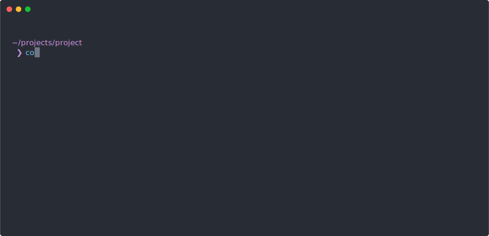

# Commit Maker [](https://www.python.org/) [](https://docs.astral.sh/uv/) [](https://ollama.com/)


## All commits in the repository are generated by this program
This CLI utility automatically creates meaningful git commit messages using local models via ollama/Mistral AI API based on the output of `git status` and `git diff` commands. It is implemented as a single file for easy conversion into an executable.

1. [Features](#features)
2. [Requirements](#requirements)
   - [Mistral](#getting-a-mistral-ai-api-key)
   - [Ollama](#installing-ollama)
3. [Installation](#installation)
4. [Setting up environment variables](#setting-up-environment-variables)
   - [Windows](#windows)
   - [Linux/MacOS](#linuxmacos)
5. [Usage](#usage)
6. [Notes](#notes)
7. [License](#license)

## Features
- Automatically generates meaningful commit messages in Russian
- Interactive confirmation before creating a commit
- Works with both existing and new Git repositories
- Uses local models/Mistral AI API to generate commit messages based on repository changes

## Requirements
- Git installed on your system
- Mistral API key (for using Mistral AI API)
- Ollama installed on your system (for using local models)

### Getting a Mistral AI API Key
To get a key, go to the Mistral console website [Mistral](https://console.mistral.ai/api-keys) and create an API key. You need a [Mistral](https://auth.mistral.ai/ui/login) account to do this.

### Installing Ollama
To install ollama, go to the [Ollama](https://ollama.com/download) website and choose the method suitable for your system.

## Installation

### From PyPI
```bash
pip install commit-maker
```

### From Source
When installing from source, use the `-e` flag to always have the latest version of the utility after `git pull` **without reinstallation**!
```bash
git clone https://github.com/Sashayerty/commit_maker
cd ./commit_maker
# Windows
pip install -r requirements.txt
# Linux/MacOS
pip3 install -r requirements.txt
```

## Setting Up Environment Variables
After installing the utility, you must add the `MISTRAL_API_KEY` environment variable.

### Windows
1. Open Command Prompt as Administrator
2. Set the Mistral API key:
   ```cmd
   setx MISTRAL_API_KEY "your_api_key_here"
   ```
3. Restart your terminal/IDE to apply the changes

### Linux/macOS
1. Open the terminal
2. Add to your shell configuration file (`~/.bashrc`, `~/.zshrc`, or `~/.bash_profile`):
   ```bash
   export MISTRAL_API_KEY="your_api_key_here"
   ```
3. Reload the configuration:
   ```bash
   source ~/.bashrc  # or whichever file you edited
   ```

## Usage
```bash
commit_maker [OPTION] [VALUE]
```

### Usage Examples
**-h**, **--help** - display help  
**-l**, **--local-models** - use local models  
**-m**, **--max-symbols** - limit the length of the commit message  
**-M**, **--model** - specify which local model to use (with **-l**)  
**-d**, **--dry-run** - display the message based on staged changes without creating a commit  
**-t**, **--temperature** - model temperature when creating the message  
**-e**, **--exclude** - files to ignore when creating the commit message  
**-w**, **--wish** - wishes/edits for the message  
**-L**, **--language** - change language of commits  
**-V**, **--version** - show version  

1. Use local models, limit commit message length to 300 characters, use qwen2.5:12b
   ```bash
   commit_maker -l -m 300 -M qwen2.5:12b
   ```
2. Use Mistral, temperature 1.3, dry run
   ```bash
   commit_maker -t 1.3 -d
   ```
3. Local models, interactive model selection
   ```bash
   commit_maker -l
   ```
4. Local models, message length 100 characters, ignore `uv.lock`, wish "Mention the README.md change"
   ```bash
   commit_maker -l -m 100 -e "./uv.lock" -w "Mention the README.md change"
   ```

## Notes
- To view all possible script execution options, add the `--help` flag
- The script will show the generated commit message before creating it
- You can regenerate the message by pressing `r` when prompted for confirmation
- By default, messages are generated in Russian (can be changed in the script)

## License
Commit Maker is licensed under [MIT](LICENSE)
